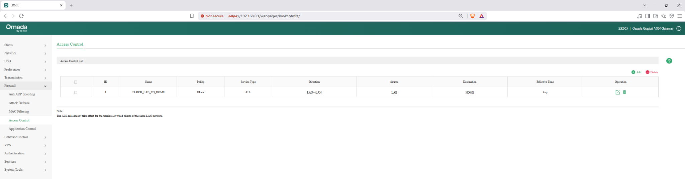
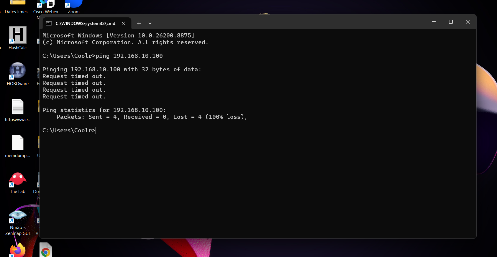
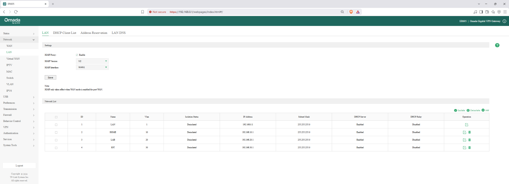
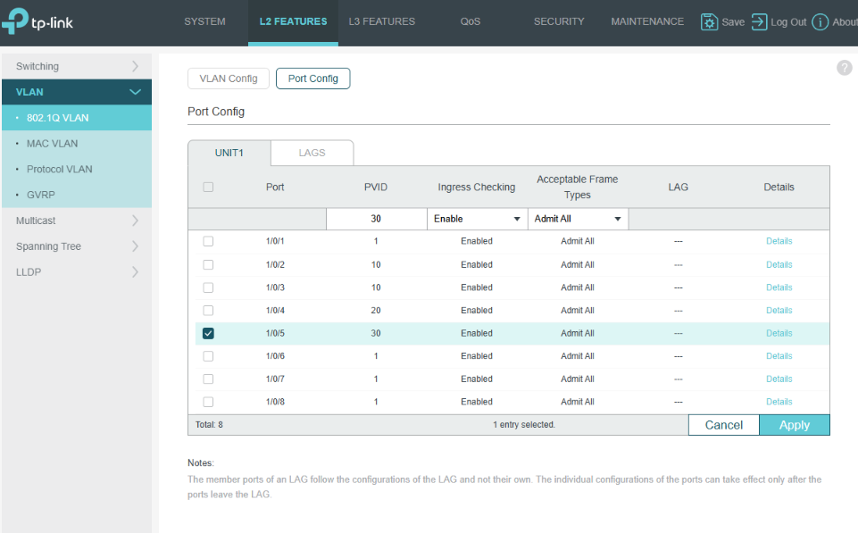
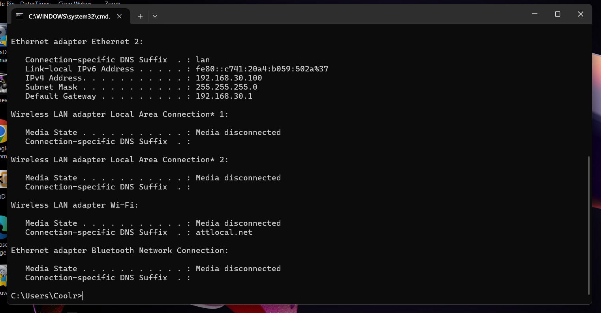
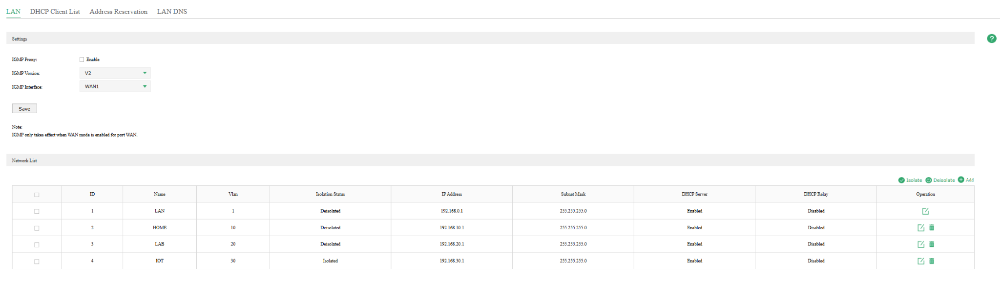
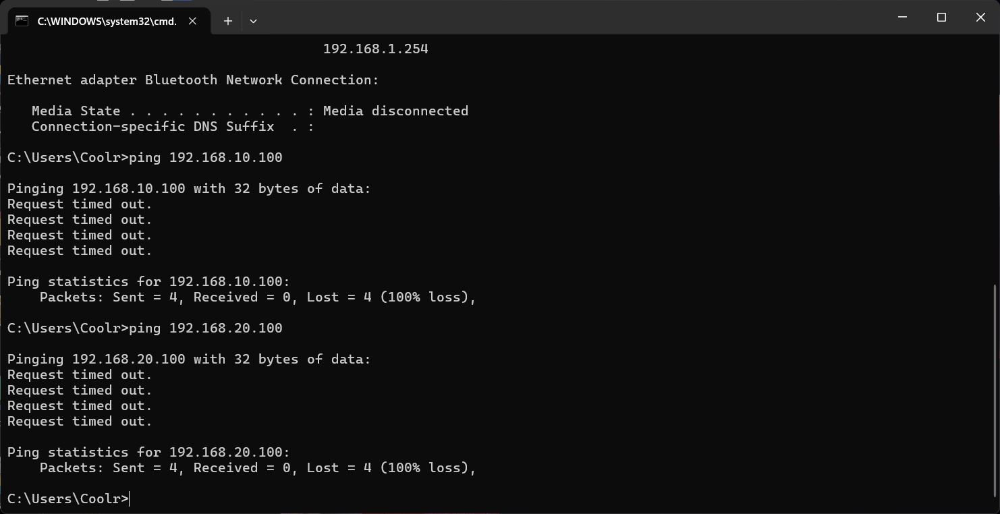

# Home Network Segmentation Lab

## Project Overview

This project demonstrates the design and implementation of a segmented home network using VLANs, inter-VLAN routing, DHCP, ACLs, and network isolation.

The goal was to separate trusted devices, lab systems, and IoT devices into different network segments while maintaining internet connectivity and controlling communication between VLANs.

The lab was built using a TP-Link ER605 VPN router and a TP-Link SG2008 managed switch.

## Objectives

- Create multiple VLANs for different device groups
- Configure separate IPv4 subnets and DHCP scopes
- Configure tagged and untagged switch ports
- Assign PVIDs to access ports
- Configure inter-VLAN routing
- Restrict LAB access to the HOME network using an ACL
- Fully isolate the IoT VLAN from internal networks
- Validate segmentation using DHCP, ICMP, and internet connectivity testing
- Document troubleshooting and configuration results

## Hardware and Software

- TP-Link ER605 Gigabit VPN Router
- TP-Link SG2008 Managed Switch
- Windows 11 Desktop PC
- Windows Laptop
- PlayStation 5
- Ethernet cabling
- TP-Link web management interfaces
- Windows Command Prompt
- Windows PowerShell
- Windows Defender Firewall with Advanced Security


## VLAN and IP Addressing Plan

| VLAN | Name | Subnet | Gateway | DHCP Range | Purpose |
|---|---|---|---|---|---|
| 10 | HOME | 192.168.10.0/24 | 192.168.10.1 | 192.168.10.100-199 | Trusted personal devices |
| 20 | LAB | 192.168.20.0/24 | 192.168.20.1 | 192.168.20.100-199 | Lab and testing systems |
| 30 | IOT | 192.168.30.0/24 | 192.168.30.1 | 192.168.30.100-199 | IoT devices / future wireless access point |


## Switch Port Assignments

| SG2008 Port | VLAN | Mode | PVID | Connected Device / Purpose |
|---|---|---|---|---|
| Port 1 | VLAN 10, 20, 30 | Tagged trunk | 1 | Uplink to TP-Link ER605 |
| Port 2 | VLAN 10 HOME | Untagged access | 10 | Windows desktop PC |
| Port 3 | VLAN 10 HOME | Untagged access | 10 | PlayStation 5 |
| Port 4 | VLAN 20 LAB | Untagged access | 20 | Windows laptop |
| Port 5 | VLAN 30 IOT | Untagged access | 30 | IoT / future wireless access point |

The switch uplink on Port 1 carries multiple VLANs using 802.1Q tagging. End-device ports are configured as untagged access ports with matching PVIDs.


## Network Topology

The final network design separates trusted devices, lab systems, and IoT devices into independent VLANs while using the ER605 for routing, DHCP, ACL enforcement, and network isolation.

```text
Internet
   |
AT&T Gateway
   |
ER605 Router
   |
   | 802.1Q trunk
   | VLAN 10 / 20 / 30
   |
SG2008 Managed Switch
   |
   +-- Port 2 -> VLAN 10 HOME -> Desktop PC
   |
   +-- Port 3 -> VLAN 10 HOME -> PlayStation 5
   |
   +-- Port 4 -> VLAN 20 LAB  -> Laptop
   |
   +-- Port 5 -> VLAN 30 IOT  -> Future Wireless Access Point / IoT
```

### Segmentation Policy

- LAB → HOME: Blocked using an ER605 ACL
- LAB → Internet: Allowed
- IOT → HOME: Blocked using network isolation
- IOT → LAB: Blocked using network isolation
- IOT → Internet: Allowed


## Validation and Testing

The network was validated using DHCP assignments, ICMP testing, internet connectivity checks, ACL enforcement, and VLAN isolation.

### LAB to HOME ACL Validation

An ACL was created on the ER605 to block traffic from the LAB VLAN to the HOME VLAN while preserving internet access.



After the ACL was applied, ICMP traffic from LAB to HOME was successfully blocked.



### IoT VLAN Validation

VLAN 30 was configured with its own subnet, DHCP scope, and access port.



Port 5 on the SG2008 was assigned PVID 30 for IoT access.



A test device connected to the IoT port successfully received a VLAN 30 address and retained internet access.



The IoT VLAN was then isolated from the other internal networks.



Final testing confirmed that IoT could not reach HOME or LAB.



## Troubleshooting

### Troubleshooting: ICMP Testing Initially Failed

During validation, ICMP requests between VLANs initially timed out even before the ER605 ACL was applied.

The issue was traced to Windows Defender Firewall. The Ethernet connection was using the Public network profile, while the existing ICMP Echo Request rule applied only to the Private profile.

A temporary inbound ICMPv4 rule was created for traffic originating from the LAB subnet (`192.168.20.0/24`). Once enabled, LAB-to-HOME ping tests succeeded, confirming that inter-VLAN routing was functioning correctly.

After the ER605 ACL was applied, the same ping test returned 100% packet loss, proving that the router ACL—not the Windows host firewall—was responsible for blocking LAB-to-HOME traffic.

The temporary Windows firewall rule was removed after testing.

## Skills Demonstrated

- VLAN creation and segmentation
- IPv4 subnetting and DHCP scope configuration
- 802.1Q VLAN tagging
- Access port and trunk configuration
- PVID assignment
- Inter-VLAN routing
- Access Control List (ACL) configuration
- Network isolation
- Windows Defender Firewall troubleshooting
- ICMP connectivity testing
- Layer 2 and Layer 3 troubleshooting
- Network documentation and validation

## Final Results

The completed network successfully separates trusted HOME devices, LAB systems, and IoT devices into dedicated VLANs.

- HOME devices operate on VLAN 10
- LAB systems operate on VLAN 20
- IoT devices operate on VLAN 30
- LAB traffic to HOME is blocked by an ER605 ACL
- IoT traffic to HOME and LAB is blocked through network isolation
- LAB and IoT networks retain internet access
- DHCP successfully assigns addresses from each VLAN's dedicated subnet

This project provided hands-on experience designing, implementing, troubleshooting, and validating a segmented network using real networking hardware.
